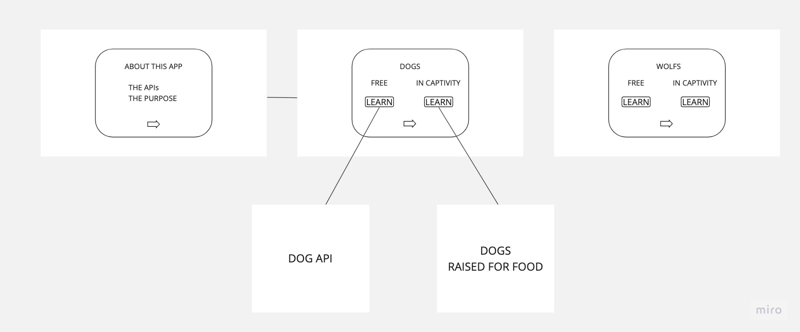

<!-- @format -->

### Project name and introduction

This is a class project for the Per Scholas[https://perscholas.org] React.js developer bootcamp

I created an app to prompt users with a choice: either view a random image of a cat, dog, duck, or foxfrom a public API or learn about the plight of these animals in captivity.

I spend several hours searching for a cool API to use that could hold my interest while building an app and that would not be too difficult to work with.

### Requirements

- Built with CSS, JAvaScrict and REACT (Create-React-App)
- Host live ⬇️
 **[https://sba-320-h.vercel.app/]**
- Frequent commits to GitHub
- A README.md file in your GitHub repository
- Use AJAX to make a request to an external data source

### APIs Used

Random Fox Images https://randomfox.ca/
Random Cat Images'https://thecatapi.com/
Random Duck Imageshttps://random-d.uk/api
Random Dog Images https://dog.ceo/

### Recommended modules

- React Bootstrap
- Axios
- React Router Dom

### Installation

- Clone this repo[https://github.com/benjahmin-koenigsberg/SBA_320H.git]
- Install node modules

```
npm install
```

- Start local server

```
npm run start
```

### Sample Screen Shots

Wireframe 🔽




### Challenges

I ran into a lot of difficulty with CORS error when making simple GET requests to free and public APIs. I tried using different browsers and making requests with diffrent headers and configs.

I ended up using a free proxy service to make a few of the API calls

https://corsproxy.io

I have had success with COR blocking web extensions, although I know those won't work in production

I will need to spend more time, building more apps with Redux to feel proficent using it

I really enjoy Boostrap and think I like it it better than Tailwind although I still need to improve with basic responsive layout CSS

I would also like to learn how to use the Cloudinary API

### Features to Add

I would like to add slides for more animals and include more links and calls to actions to help captive and wild animals
